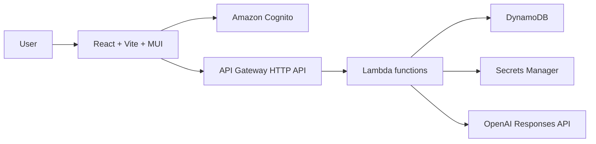

# Mortgage Product Copilot

Mortgage Product Copilot is an internal mortgage product knowledge and recommendation system for loan officers and mortgage professionals. It combines a React + TypeScript frontend, AWS SAM + Lambda backend, Cognito authentication, DynamoDB storage, and OpenAI-based product guidance.

## Architecture



## Repository structure

- backend: AWS SAM templates, Lambda handlers, shared libraries, and tests
- frontend: Vite React app with MUI and Amplify auth integration
- data: mortgage product seed data
- docs: architecture, API, deployment, security, and operations guides
- scripts: seed and configuration helpers

## Prerequisites

- Python 3.13
- Node.js 20+
- AWS CLI configured
- AWS SAM CLI
- Docker optional for local SAM testing

## Local development

```bash
python3 -m venv .venv
source .venv/bin/activate
pip install -r backend/requirements.txt
cd frontend && npm install
```

## Testing

```bash
cd backend && PYTHONPATH=src pytest -q tests/unit
cd frontend && npm test -- --run
cd backend && sam validate --lint
```

## Deployment

1. Create the GitHub OIDC role and configure the workflows.
2. Deploy the SAM backend.
3. Configure Amplify Hosting and frontend environment variables.
4. Seed products with the provided script.

## Manual setup still required

- Create the Google OAuth app in Google Cloud.
- Store the Google client secret securely.
- Create the OpenAI secret in Secrets Manager.
- Create the GitHub OIDC role and the production environment.
